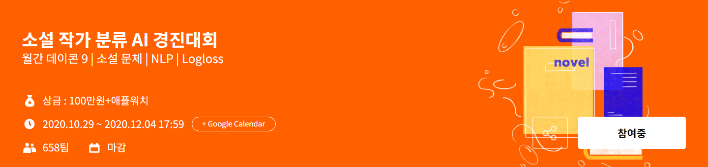
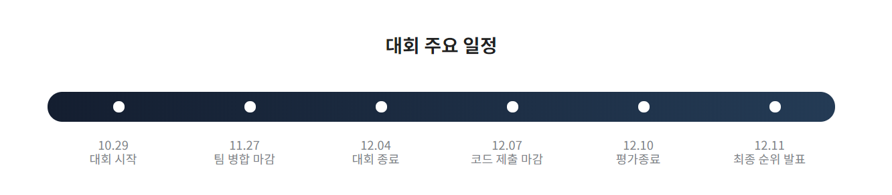

# 소설 작가 분류 AI 경진대회
---

## 대회 주요 일정 

## 개요
---
### 0. 참가 배경 
- 자연어 처리 분야를 경험해보기 위해 맛보기로 참가 
- 소스코드는 공유 코드를 활용
### 1. 과제 
- 문제 분석 알고리즘 개발(소설 속 문장뭉치 분석을 통한 저자 예측)  
### 2. 과제 배경 
1. 작가의 글을 분석하여 특징 도출
2 취향 추천 시스템 활용 / 대필, 유사작 탐지
### 3. 대회 설명 
- 문체 분석 알고리즘 개발(소설 속 문장뭉치 분석을 통한 저자 예측)
- 작가의 글을 분석하여 특징 도출
- 취향 추천 시스템 활용 / 대필, 유사작 탐지
### 4. 주최/주관
- 주최: DACON
- 주관: DACON
- 후원: 이노베이션 아카데미
### 5. 평가 기준  
- 심사 기준: LogLoss
- 1차 평가(Public Score): 테스트 데이터 중 랜덤 샘플 된 30%로 채점, 대회 기간 중 공개
- 2차 평가(Private Score): 나머지 70 % 테스트 데이터로 채점, 대회 종료 직후 공개
### 6. 규칙 
- 1일 최대 제출 횟수: 3회
- 사용 가능 언어: Python, R
- 모델 학습에서 검증 혹은 평가 데이터셋 활용(Data Leakage)시 실격
### 7. 시상 내역 
- 1등: 이노베이션 아카데미 "42 Prize": 애플 워치 SE
- 2-11등: 100,000원
### 8. 팀구성 
- 작업툴: Python, Google Colab, Jupyter Notebook
- 인원: 2명
- 주요 업무: 코드 작성(전처리, 모델링)
- 기간: 2020.12.03 - 2020.12.04  
### 9. 대회 결과 
- Public chart 127/287 (전체 참가 팀: 658팀) 
- Private chart 124/287 (전체 참가 팀: 658팀)
