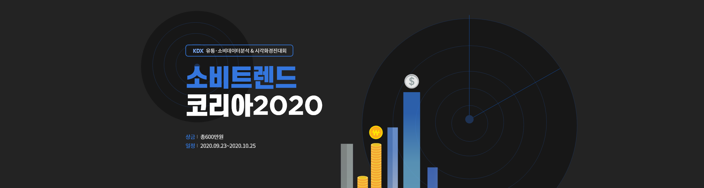

# KDX_2020_project
소비트렌드 코리아 2020_ 유통소비데이터분석 &amp; 시각화경진대회 from KDX 한국데이터거래소  

**대회 결과 : 우수상**

# contest
---
## 1st. KDX_소비트렌드 코리아 2020   
  

**KDX 유통·소비데이터 분석 & 시각화 경진대회**  
- **일정:** 2020.09.23 - 2020.10.25  
- **주최 및 주관:** MBN, KDX한국데이터거래소  
- **후원:** NIA 한국정보화진흥원
- **데이터 제공기업:** 삼성카드, 신한카드, Gin+, MCorporation  

## 개요 
---

**1. 과제**  
- KDX의 다양한 데이터와 외부 데이터를 활용해 한국의 소비 트렌드를 분석해 인사이트를 도출하고 이를 보기 좋게 시각화 해주세요.

**2. 설명**  
- KDX가 제공하는 다양한 소비 데이터(온라인 쇼핑, 오프라인 신용카드, 부동산 등)를 분석해주세요.  
- 분석 결과는 참신한 아이디어와 창의력을 이용해 시각화 해주세요.  
- 공공과 민간을 가리지 않고 많은 분야에 활용될 수 있는 결과가 나온다면 더욱 환영입니다.  

**3. 평가기준** 
|기준 항목|내용|  
|-|-|  
|인사이트 점수|인사이트 도출 / 논리 명확성 / 주제 선정과 분석 창의성|  
|기술 점수|분석 기술 수준|  
|실용 점수|대시보드 시장성과 품질| 

**4. 규칙**
- 내부 분석환경에서 코드 저장 후 제출 페이지에서 제출
 - 제공 분석환경: Python Jupyter Notebook, R studio)
- 제출 파일은 final_analysis (.rmd, .rmarkdown, .ipynb) 이름으로 저장 
- 시각화된 자료는 캡쳐 또는 다운받아서 ppt로 대시보드 구성 > 제출 페이지 통해 제출
- 기획안 ppt는 pdf로 변환하여 제출 페이지에서 첨부 파일로 제출
- 대시보드는 5개 이상의 차트로 구성, 인사이트에 대한 설명 필요

**5. 시상 내역**
- 대상(1팀) 300만원
- 최우수상(1팀) 150만원
- 우수상(1팀) 100만원
- 장려상(2팀) 각 25만원  

**6. 팀구성 및 역할**
- 작업툴 : R Studio
- 인원 : 3명 
- 주요 업무 : 주제 및 세부 뱡향성 선정, PPT 제작, 코드 시각화

**7. 팀 주제  **
- 주제 : "코로나19 발생 이후 색조 및 기초 화장품 수요 비교분석"  
- 주제 선정 이유 : 코로나19로 인한 마스크 일상화/의무화 시대, 화장품 업계 매출 추이를 살펴보고 발전 방향 제언하기 

**8. Use Data**
- 엠코퍼레이션 온라인 구매 데이터 Mcorporation online purchase data    
- 신한카드 오프라인 구매 데이터 Shinhancard offline purchase data  
- 네이버 키워드 검색량 데이터 Naver keyword search data
  
**9.  대회 결과** 
: 3등, 우수상(R러뷰 팀)   
   

